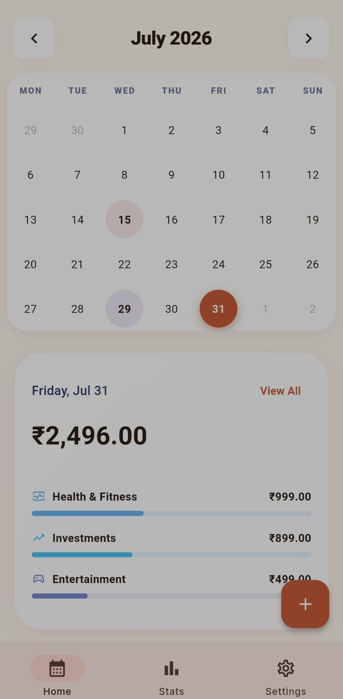
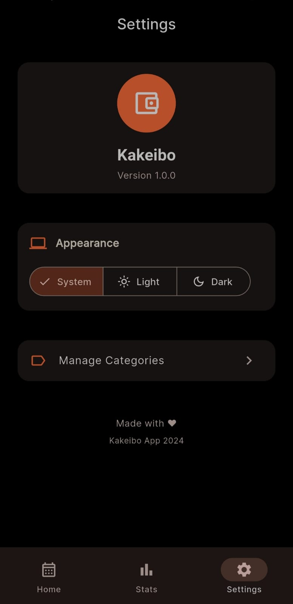
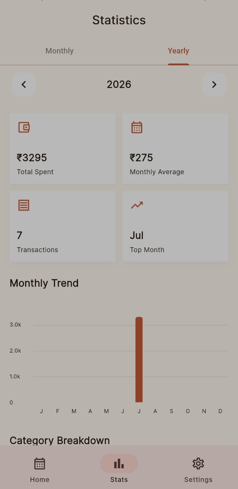
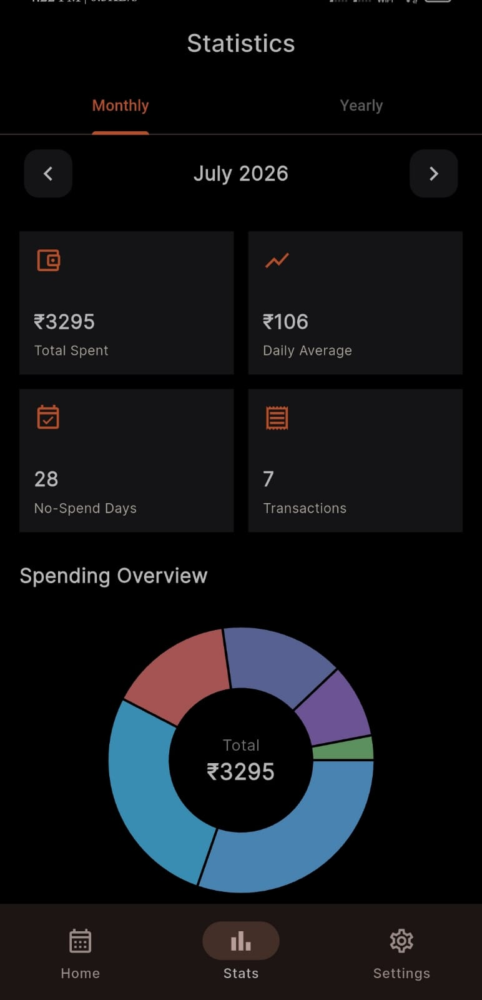
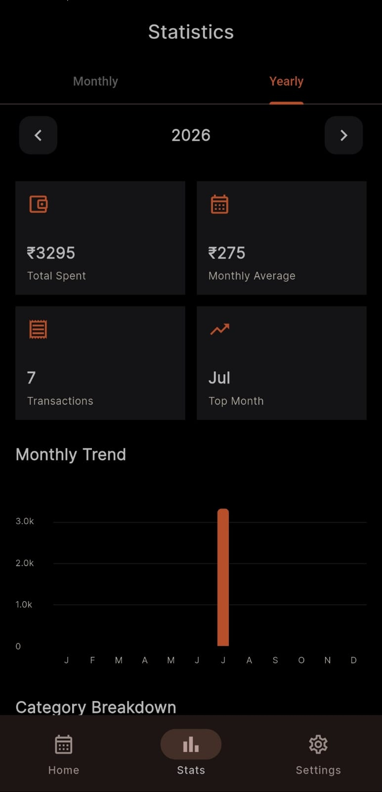
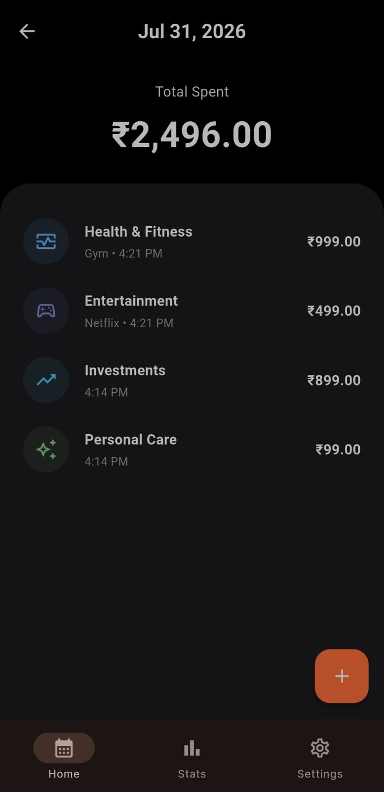
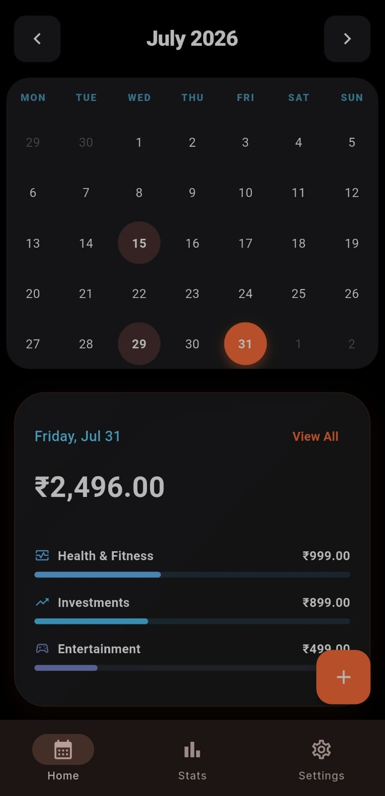
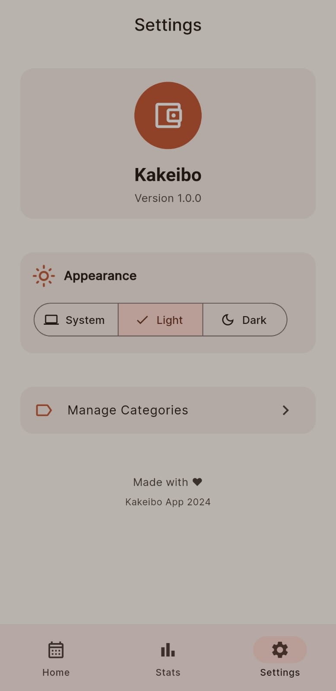
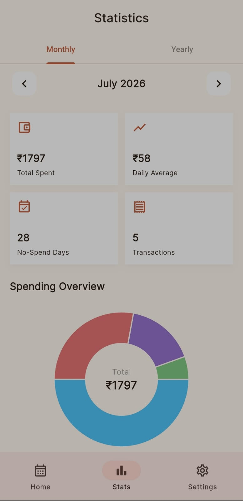
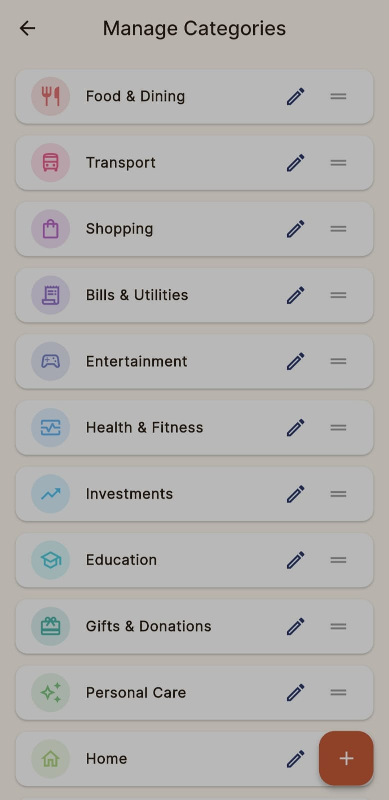

# 🌸 Kakeibo (家計簿)


> **Kakeibo** is a beautifully designed, lightning-fast, and completely offline personal finance app inspired by the traditional Japanese art of budgeting. Rather than just tracking pennies, Kakeibo focuses on **habit tracking for spending money** — helping you build mindfulness around where your wealth flows.

[](https://flutter.dev/)
[](https://riverpod.dev/)
[](https://pub.dev/packages/sqflite)

---

## ✨ Features

- **Mindful Tracking**: Quick and seamless entry for daily expenses and incomes.
- **Visual Insights**: Stunning heatmap calendars and spending donut charts that make understanding your habits effortless.
- **Custom Categories**: Fully customizable categories with a vibrant 24-color palette and over 50+ handpicked icons.
- **Stunning Aesthetics**: Premium UI/UX featuring glassmorphism effects, smooth micro-animations, and a true OLED Black Dark Mode.
- **Privacy First**: 100% offline. No servers, no tracking, no cloud accounts required. Your data stays on your device using local SQLite.
- **Lightning Fast**: Optimized with `--split-per-abi` for an incredibly lightweight footprint.

---

## 📸 Screenshots

| | | | | |
|:---:|:---:|:---:|:---:|:---:|
|  |  |  |  |  |
|  |  |  |  |  |

---

## 🚀 Getting Started

Follow these instructions to get a copy of the project up and running on your local machine for development and testing purposes.

### Prerequisites

Ensure you have the following installed on your machine:
- [Flutter SDK](https://docs.flutter.dev/get-started/install) (Version 3.19.0 or higher recommended)
- [Dart SDK](https://dart.dev/get-dart)
- Android Studio / VS Code (with Flutter extensions)

### Installation

1. **Clone the repository**
   ```bash
   git clone https://github.com/yugalbangare4/kakeibo.git
   cd kakeibo
   ```

2. **Install Dependencies**
   ```bash
   flutter pub get
   ```

3. **Run the App**
   Connect your physical device or launch an emulator, then run:
   ```bash
   flutter run
   ```

### Building for Production (Android)

To generate a lightweight release APK, use the split-per-abi flag. This heavily reduces the app size, making it lightning-fast to download and install.

```bash
flutter build apk --split-per-abi
```
You will find the generated APKs in `build/app/outputs/flutter-apk/`.

---

## 🏗️ Tech Stack & Architecture

This project is built with modern Flutter best practices:

- **Framework**: [Flutter](https://flutter.dev/)
- **State Management**: [Riverpod](https://riverpod.dev/) (`flutter_riverpod`) - Ensuring robust, scalable, and testable reactive state.
- **Local Storage**: [Sqflite](https://pub.dev/packages/sqflite) - Secure, fast, and entirely local SQL database.
- **Routing**: [GoRouter](https://pub.dev/packages/go_router) - Declarative routing for Flutter.
- **Animations**: [Flutter Animate](https://pub.dev/packages/flutter_animate) - Smooth, beautiful micro-interactions.

### Folder Structure
The app is modularized following feature-first architecture:
```text
lib/
 ├── core/              # Theme, Utilities, Constants
 ├── database/          # SQLite Initialization & Migrations
 ├── features/          # App Features (Feature-First Architecture)
 │    ├── calendar/     # Heatmap & Daily Summaries
 │    ├── categories/   # Icon Picker, Color Picker, Category CRUD
 │    ├── expenses/     # Expense Models, Repositories, Entry UIs
 │    ├── settings/     # Theme Toggle & App Settings
 │    └── statistics/   # Donut Charts & Spending Breakdowns
 └── main.dart          # App Entry Point
```

---

## 🤝 Contributing

Contributions are what make the open source community such an amazing place to learn, inspire, and create. Any contributions you make are **greatly appreciated**.

1. Fork the Project
2. Create your Feature Branch (`git checkout -b feature/AmazingFeature`)
3. Commit your Changes (`git commit -m 'Add some AmazingFeature'`)
4. Push to the Branch (`git push origin feature/AmazingFeature`)
5. Open a Pull Request

---

## 📜 License

Distributed under the MIT License. See `LICENSE` for more information.

---

## 💖 Acknowledgements

- The traditional Japanese budgeting philosophy of [Kakeibo](https://en.wikipedia.org/wiki/Kakeibo) for inspiring mindful spending.
- The vibrant Flutter open-source community.

<p align="center">Made with ❤️ for mindful spending.</p>
